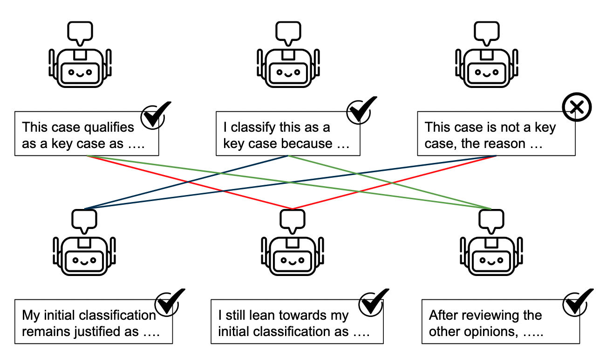
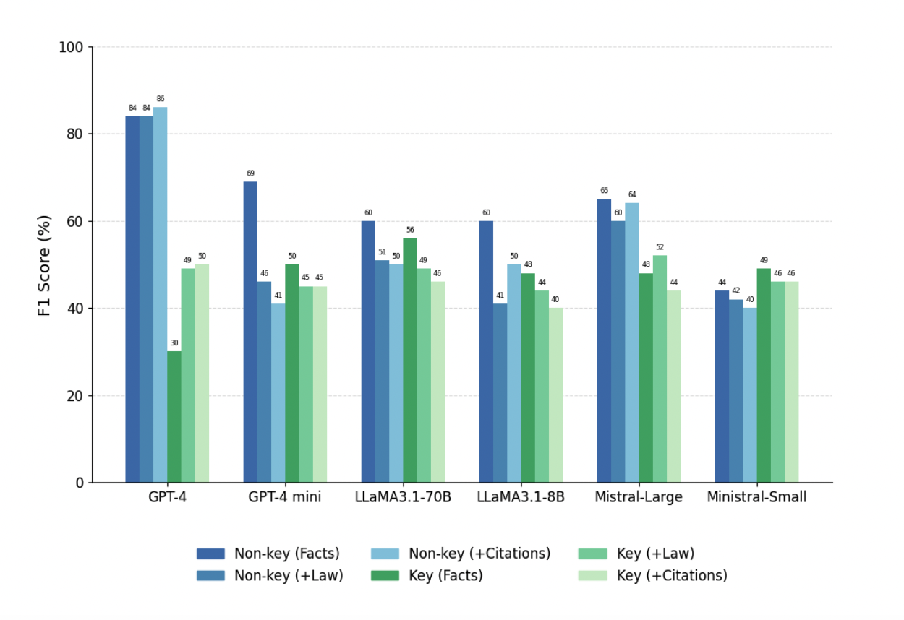

In recent years, artificial intelligence, particularly large language models (LLMs) like GPT-4, has transformed numerous industries by automating complex tasks. But can these powerful tools reliably classify the significance of court cases—specifically at the European Court of Human Rights (ECtHR)? This was precisely the research question I tackled in my MSc thesis at the Technical University of Munich, working in the Legal NLP lab.

## Background

The European Convention on Human Rights (ECHR), established in 1950 in response to the horrors of World War II, represents a commitment to protecting fundamental human rights across Europe. The European Court of Human Rights (ECtHR) began operating in 1959 with a mandate to interpret and enforce the Convention's guarantees across all member states of the Council of Europe.

Over the decades, the ECHR has expanded both in reach and influence. Its jurisprudence is characterized by a dynamic interpretative approach, reflecting the principle that the Convention must be interpreted in light of contemporary conditions to ensure that protections keep pace with evolving moral and social standards. As the Court itself emphasizes:

> "What gives the Convention its strength and makes it extremely modern is the way the Court interprets it: dynamically, in the light of present-day conditions."  
> — [The Convention, a modern instrument (Page 7)](https://www.echr.coe.int/documents/d/echr/Convention_Instrument_ENG)

This concept of the Convention as a **living instrument** has allowed the Court to adapt its application to modern issues that could not have been anticipated when it was first created—challenges posed by new technologies, environmental concerns, and sensitive topics such as terrorism and migration.

The current case importance levels are as follows:

- **Key cases**: The most significant judgments, decisions, and advisory opinions selected by the Bureau of the Court based on their substantial legal and societal impact.
- **Level 1 (High Importance)**: Significant contributions to the development or clarification of case-law, generally or for a specific state.
- **Level 2 (Medium Importance)**: Go beyond applying existing case-law, but without major contribution to jurisprudence.
- **Level 3 (Low Importance)**: Of little legal interest—typically simple applications of case-law, friendly settlements, or strikeouts unless a particular point of interest is raised.

## Methodology

To explore this, I conducted extensive experiments with six state-of-the-art LLMs across three major model families:

- **OpenAI GPT Models**: GPT-4o and GPT-4o-mini  
- **Meta's LLaMA Models**: LLaMA3.1-70B and LLaMA3.1-8B  
- **Mistral Models**: Mistral Large and Mistral 8B  

These models were evaluated in a *zero-shot* scenario—meaning they were not provided with specific examples of key case classifications beforehand. Instead, they relied solely on their general training to classify cases accurately. The experiments involved three different input scenarios:

- **Facts Only**: Models were provided only with factual descriptions from the cases.
- **Facts + Legal Reasoning (+Law)**: Models received both factual information and detailed court reasoning.
- **Facts + Legal Reasoning + Citations (+Citations)**: Models were also given structured analyses of relevant legal precedents cited within each case.

Additionally, I implemented and tested advanced reasoning workflows aimed at improving the models' analytical capabilities:

- **ReAct (Reasoning + Acting)**: Interleaved reasoning steps with strategic tool usage, allowing the model to iteratively refine its conclusions.

- **Multi-Agent Debate**: Multiple instances of the same LLM debated their reasoning over multiple rounds, refining classification decisions through collaborative analysis and critique.

## Key Findings

### Model Performance Insights

- **Performance Variability**: GPT-4o emerged as the top-performing model, achieving a macro-F1 score of 68.5%. However, its decisions frequently stemmed from flawed reasoning paths, raising concerns about reliability in sensitive legal contexts.

- **Importance of Legal Context**: Using facts alone led to superficial, summary-based judgments. Adding legal reasoning significantly improved accuracy.

- **Mixed Effects of Citations**: Integrating detailed citation analyses sometimes helped, but occasionally confused the models—highlighting inconsistency across different LLMs.

### Workflow Enhancements

- **Agent-Based Workflows**: The ReAct framework showed promise by enabling more transparent and structured reasoning. Still, models often reached conclusions prematurely without fully exploiting available resources.

- **Debate Limitations**: The multi-agent debate method improved some outcomes, but agents often reinforced their initial (sometimes incorrect) beliefs rather than correcting them.

## Critical Observations

- **Evaluating Reasoning Quality**: Traditional evaluation metrics like accuracy and F1 scores fail to capture the nuances of legal reasoning. These metrics alone are insufficient.

- **Reasoning vs. Summarization**: While models demonstrated strong summarization skills, they often struggled to deliver meaningful legal interpretations without explicit contextual guidance.

> The findings suggest that while models can technically handle long input contexts, they don’t always benefit from them in practice.

## Implications and Future Directions

My thesis underscores both the substantial potential—and the critical limitations—of leveraging LLMs in legal contexts. It highlights the urgent need for specialized methods and metrics that go beyond surface-level accuracy to assess the *quality* of legal reasoning.

Several promising research directions emerge:

- **Advanced Evaluation Frameworks**: Developing robust, qualitative metrics to ensure that models provide not just accurate classifications, but also sound and justifiable reasoning.

- **Legal Comparison Mechanisms**: Future models might benefit from frameworks that systematically compare new cases against precedents, identifying critical deviations that signal important jurisprudential developments.

## Conclusions

This work introduced a binary classification task aimed at identifying *Key Cases* within ECtHR jurisprudence—a high-stakes application that pushes the boundaries of what current LLMs can handle in legal reasoning.

Through zero-shot chain-of-thought prompting, several key trends emerged:

- **GPT-4o** stood out for its consistent improvement when provided with richer contextual inputs, showing a clear benefit from more detailed legal information.
- In contrast, **other models** (LLaMA and Mistral families) tended to perform best with minimal input, and their performance often deteriorated as more complex context was added—highlighting the risk of *context saturation*.
- A major challenge was the **lack of annotated reasoning ground truth**, making it hard to assess the quality of the models’ justifications. In many cases, models reached the *correct outcome* but through **incomplete or flawed logic**, which undermines trust in their legal applicability.
- **Multi-agent debate** setup was limited by the initial round of reasoning: if the first zero-shot chain-of-thought was weak, subsequent debate rounds often failed to correct the trajectory.

## References

- Zhang, T., Kishore, V., Wu, F., Weinberger, K. Q., & Artzi, Y. (2019). Bertscore: Evaluating text generation with bert. arXiv preprint arXiv:1904.09675.
- Zha, Y., Yang, Y., Li, R., & Hu, Z. (2023). AlignScore: Evaluating factual consistency with a unified alignment function. arXiv preprint arXiv:2305.16739.
- Touvron, H., Lavril, T., Izacard, G., Martinet, X., Lachaux, M. A., Lacroix, T., ... & Lample, G. (2023). Llama: Open and efficient foundation language models. arXiv preprint arXiv:2302.13971.
- Du, Y., Li, S., Torralba, A., Tenenbaum, J. B., & Mordatch, I. (2023). Improving factuality and reasoning in language models through multiagent debate. arXiv preprint arXiv:2305.14325.
- https://www.echrblog.com/2025/01/reflections-on-courts-key-case-law-of.html
